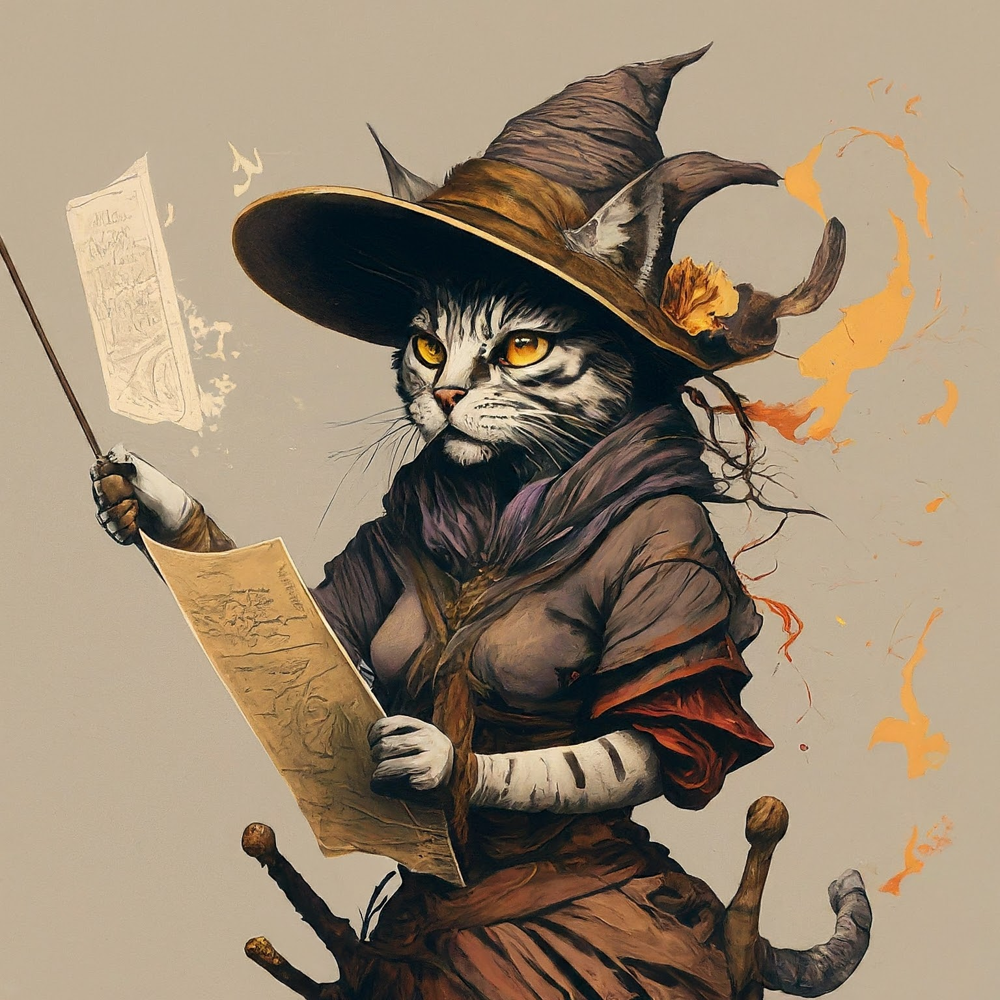

# Shushinda's Game


<p align="center">
    
</p>

Shushinda Hushwhisper, born into a long line of unremarkable wizards, held no extraordinary promise. In fact, his talent lay in making the ordinary a touch chaotic. A magical accident quite early in his studies left his spells prone to targeting library materials rather than their intended subjects. This penchant for rearranging spellbooks and summoning dusty tomes was a source of constant frustration for his professors, but a secret delight for Shushinda.


# Installation


```bash
export MY_PROJECT=`gcloud config get-value project`

export TF_VAR_project=$MY_PROJECT

```


After running the TF and loading some docs, generate the vectors:
https://cloud.google.com/bigquery/docs/vector-search#create_a_vector_index


Maybe?
Create:
```sql
CREATE VECTOR INDEX chunk_vector ON shushindas_stuff.chunks(embedding_v1)
OPTIONS(distance_type='COSINE', index_type='IVF', ivf_options='{"num_lists": 1000}');
```

Check:
```sql
SELECT * FROM vector_search.INFORMATION_SCHEMA.VECTOR_INDEXES;
```
# Architecture


# Backstory

**Important facts about Shushinda Hushwisper**

* Shushinda Hushwhisper, despite her chaotic magic, managed to graduate from Unseen University – much to the surprise of her professors.
* She has a peculiar fondness for rearranging library stacks, especially when she's bored or startled.
* No one can make a stern treatise on the 'Perils of Thaumaturgy' dance quite like Shushinda.
* While her spells rarely hit their intended target, the resulting effects are often far more entertaining.
* Shushinda believes that 'a little chaos never hurt anyone' – a sentiment not shared by the librarians of Unseen University.